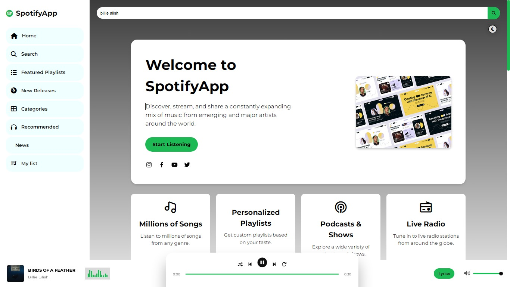

# 🎶 Music Streaming Web App

A dynamic and responsive music streaming web application built with HTML, CSS, JavaScript, and Node.js, utilizing Spotify's API for a seamless user experience. The app allows users to explore, search, and play songs with real-time data integration.

# SM4music


SM4music is a web music application developed using *HTML, **CSS, **JavaScript, and integrates with **Spotify's API* using client and secret IDs. This app is designed to provide users with a smooth music streaming experience, offering access to Spotify's vast music library.

## How to Use SM4music

To see a demonstration on how to use SM4music, click the video below:

[](https://youtu.be/s1iPXBny9Ec?si=7za99P12bDacKE7f)

---

The video explains how to navigate the interface, search for songs, and utilize various features that SM4music offers. It’s perfect for getting started with the app and understanding its capabilities.

## 🚀 Features

- **Interactive Interface**: Responsive and modern UI for music streaming.
- **Spotify Integration**: Access to Spotify's vast music database.
- **User Authentication**: Secure login and user management with Spotify's OAuth.
- **Real-Time Search**: Search for artists, albums, and tracks with instant feedback.
- **Dynamic Playlists**: Personalized playlists based on user preferences.
- **Music Player**: In-app music player with essential controls (play, pause, skip).

## 🛠️ Technologies Used

- **Frontend**: HTML, CSS, JavaScript
- **Backend**: Node.js, Express
- **API**: Spotify Web API (Client ID and Secret ID for access)
- **Authorization**: OAuth 2.0 (Spotify’s Authorization Code Flow)

# 📸 Image Gallery

Below is a preview of some images used in this project.

## Gallery

|  |  |  |
|:---------------------------:|:---------------------------:|:---------------------------:|
| Search results of artists or channels light-mode|  artists and channels info, tracks & videos dark-mode        | lyrics   |

|   |  |
|:---------------------------:|:---------------------------:|
| Your playlist songs saved dark-mode | Your playlist songs saved light-mode |

|  |  |  |
|:---------------------------:|:---------------------------:|:---------------------------:|
| Top 8 artist by likes        | latest additions Tracks       | Tracks        |

|  |  |  |
|:---------------------------:|:---------------------------:|:---------------------------:|
| Home section site introduction light-mode | Home section site introduction dark-mode      | The New Releases         |

|  |  |
|:---------------------------:|:---------------------------:|
| Search results Dark-mode       | Songs of artists searched        |
---


## ⚙️ Installation

1. Clone the repository:
   ```bash
   git clone https://github.com/Simo-elb/MusicWebapp.git
   cd SMusicWebapp
